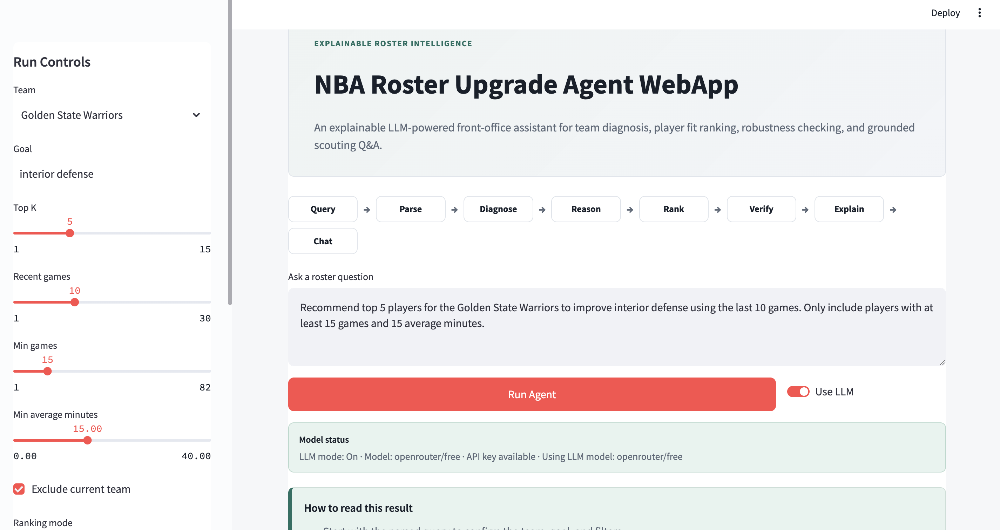
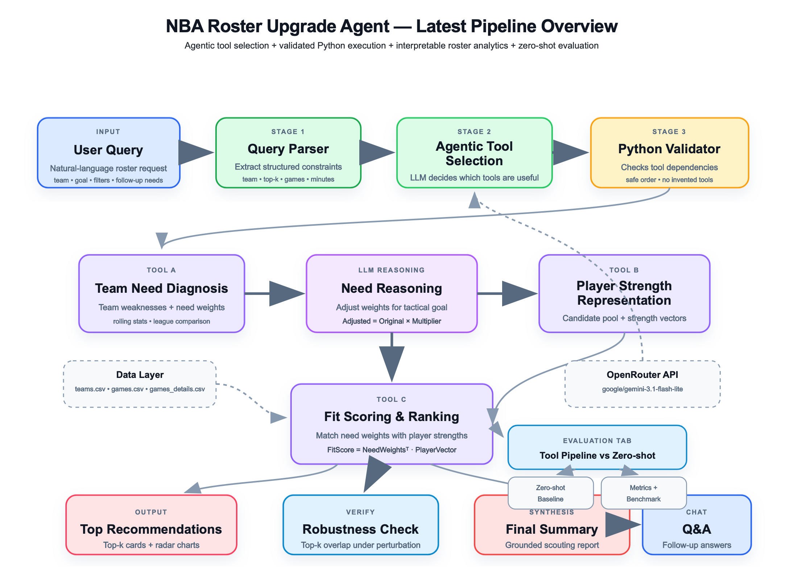
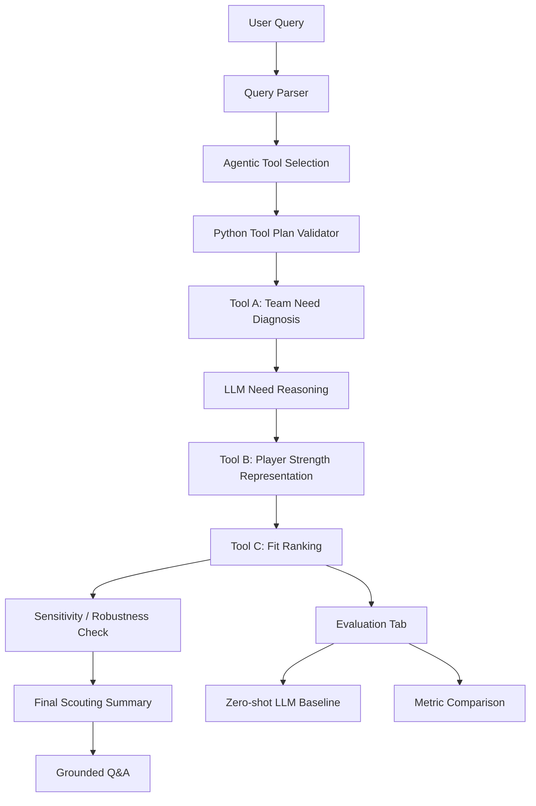

# NBA Roster Upgrade Agent WebApp

An explainable, tool-augmented LLM agent for NBA roster diagnosis, player fit ranking, robustness checking, and grounded scouting Q&A.

**Streamlit WebApp** · **LLM Tool Selection** · **Tool-Augmented Reasoning** · **Zero-shot Baseline Comparison** · **Robustness Check** · **Grounded Q&A** · **Deterministic Fallback**

## Screenshots

Screenshots can be updated after running the app locally. Existing repository screenshots are kept below, and additional placeholder paths are listed for the final README gallery.






## Overview

NBA Roster Upgrade Agent WebApp helps answer NBA roster-upgrade questions by combining structured data tools with bounded LLM reasoning. Instead of asking an LLM to directly guess player names, the system parses the user query, selects useful tools from a fixed registry, diagnoses team needs, reasons over tactical goals, represents player strengths, ranks fit, checks robustness, summarizes the result, and supports grounded follow-up Q&A. The goal is not just to produce a recommendation list; it is to make the reasoning trace inspectable, auditable, and reproducible.

## Why This Project Matters

Zero-shot LLMs can produce plausible basketball recommendations, but they are not automatically grounded in a local dataset or validated against user constraints. Pure statistical ranking can be hard to interpret because it compresses a roster decision into a single score. This project combines both approaches: data-grounded tools, LLM reasoning, transparent intermediate outputs, deterministic fallback behavior, and quantitative comparison against a zero-shot LLM baseline.

| Layer | Role |
| --- | --- |
| Custom agentic planner | Selects useful tools from a fixed registry based on the user query. |
| Python validator | Removes invalid tools and preserves safe dependencies. |
| Deterministic tools | Compute team needs, player strengths, fit scores, and robustness checks. |
| LLM modules | Parse intent, explain tactical emphasis, summarize computed outputs, and answer grounded questions. |
| Streamlit UI | Presents the result as an explainable front-office style dashboard. |

## Example Query

```text
Recommend the top 5 players for the Golden State Warriors to improve interior defense over the last 10 games. Only include players with at least 15 games and 15 average minutes. Check whether the ranking is robust, and keep a grounded Q&A section for follow-up questions.
```

## Current User Flow

1. Type a natural-language roster question.
2. Toggle `Use LLM` on or off.
3. Click `Run Agent`.
4. Confirm the model status and fallback status.
5. Review the Agentic Tool Selection decision.
6. Inspect top recommendations and ability radar charts when ranking tools are selected.
7. Read the detailed tool trace for Tool A, LLM Need Reasoning, Tool B, Tool C, Sensitivity, and Summary outputs.
8. Ask grounded follow-up questions about the current run.
9. Open the Evaluation tab to compare the Tool Pipeline against a zero-shot LLM baseline.
10. Run the Agent Tool-Selection Benchmark to evaluate whether the planner selected the expected tools.

## Agent Pipeline



## Agentic Tool Selection

The current app is not only a fixed pipeline display. It includes a lightweight custom Python agent layer for tool selection.

How it works:

1. The user query is parsed into structured intent and filters.
2. The LLM planner may propose useful tools from a fixed registry.
3. Python validates the selected tools.
4. Unknown tools are removed.
5. Required dependencies are enforced.
6. The stable executor keeps the deterministic Tool A / Tool B / Tool C computation safe.
7. The Streamlit UI displays selected tools by default, while unselected tools can be opened manually.

Example selections:

| Query Type | Expected Tools |
| --- | --- |
| Team weakness diagnosis | Tool A, Final Scouting Summary |
| Team-need explanation for a tactical goal | Tool A, LLM Need Reasoning, Final Scouting Summary |
| Player recommendation | Tool A, LLM Need Reasoning, Tool B, Tool C, Final Scouting Summary |
| Recommendation with robustness request | Tool A, LLM Need Reasoning, Tool B, Tool C, Sensitivity Check, Final Scouting Summary |
| Follow-up / chat request | Adds Grounded Q&A |
| Zero-shot comparison request | Zero-shot Baseline Comparison, Final Scouting Summary |

The LLM cannot invent tools. Tool selection is validated by Python before it affects the UI.

## Tool Descriptions

### Tool A - Team Need Diagnosis

Tool A diagnoses team weaknesses from the loaded NBA dataset and converts them into need weights. It provides the initial data-grounded signal for what the selected team appears to lack.

Output:

- Need metrics.
- Human-readable labels.
- Need weights.
- A need-weight chart.
- Full `need_df` inside an expander.

### LLM Need Reasoning

LLM Need Reasoning reads the parsed goal and Tool A output, then recommends bounded multipliers for existing need metrics. The LLM does not invent new metrics and does not calculate player rankings.

```text
Adjusted Need Weight = Original Need Weight x LLM Multiplier
```

Multipliers are validated and bounded. If the LLM is unavailable or returns invalid JSON, deterministic fallback rules are used.

### Tool B - Player Strength Representation

Tool B filters candidate players and creates player strength vectors from the existing dataset.

Typical dimensions include:

- Rebounding.
- Rim protection.
- Perimeter defense.
- Playmaking.
- Three-point shooting.
- Scoring, when available for visual display.

### Tool C - Fit Ranking

Tool C ranks candidate players by matching adjusted need weights to player strength vectors.

```text
Fit Score = Adjusted Need Weights dot Player Strength Vector
```

The LLM does not directly compute fit scores. Rankings come from deterministic Tool C logic.

### Sensitivity / Robustness Check

The robustness check perturbs adjusted need weights and compares the original top recommendations with perturbed recommendations.

| Label | Meaning |
| --- | --- |
| Stable | Top recommendations remain highly similar after perturbation. |
| Somewhat Stable | Some top recommendations remain, but the ranking changes meaningfully. |
| Unstable | Small weight changes substantially alter the recommendation list. |

### Final Scouting Summary

The final summary converts computed results into concise scouting language. It only uses current run outputs.

If Tool C was selected, the summary can discuss recommended players, fit scores, best matches, and robustness. If the query only asks about team needs, the displayed summary stays focused on Tool A diagnosis and LLM Need Reasoning without inventing player recommendations.

### Grounded Q&A

Grounded Q&A answers follow-up questions using only the current `AgentResult`. It does not search the web and does not invent unsupported facts. If the user asks about unavailable fields such as salary, contracts, injuries, or trade rumors, the assistant marks them unavailable.

## Evaluation: Tool Pipeline vs Zero-shot LLM

The Evaluation tab compares two outputs under the same user query:

1. A zero-shot LLM baseline that receives only the natural-language query.
2. The tool pipeline output generated by Tool A / Tool B / Tool C and supporting modules.

The comparison evaluates both recommendation lists with the same dataset-grounded checks.

| Metric | What It Measures |
| --- | --- |
| Candidate Found Rate | Whether recommended players can be found in the current dataset. |
| Constraint Satisfaction Rate | Whether recommended players satisfy user filters such as min games and min average minutes. |
| Average Tool C Fit Score | Average Tool C score among matched recommendations. |
| Penalized Average Tool C Fit Score | Average fit score with unmatched zero-shot players counted as zero. |
| Need Alignment Score | Alignment with diagnosed team needs under the project metric mapping. |
| Robustness Check Available | Whether the recommendation list has a sensitivity check. |
| Evidence Coverage / Explainability Score | How much verifiable intermediate evidence supports the recommendation. |

### Fairness Note

Tool C Fit Score and Need Alignment Score are internal objective metrics, not independent ground truth. Since the pipeline is designed to optimize Tool C, a higher Tool C score should be interpreted as stronger alignment with the explicit scoring objective, not universal proof of real-world basketball superiority. The stronger claim is that the pipeline is more auditable, dataset-grounded, constraint-checked, and reproducible than zero-shot prompting.

## Agent Tool-Selection Benchmark

The repository includes a lightweight benchmark for the agentic planner:

```bash
python examples/agent_tool_selection_benchmark.py
```

Optional LLM-backed run:

```bash
python examples/agent_tool_selection_benchmark.py --use-llm
```

The benchmark uses representative prompts with expected tool sets and computes:

| Metric | Meaning |
| --- | --- |
| Exact Match | Whether the selected tool set exactly equals the expected tool set. |
| Precision | Correctly selected tools divided by selected tools. |
| Recall | Correctly selected tools divided by expected tools. |
| F1 | Harmonic mean of precision and recall. |
| Dependency Validity | Whether selected tools satisfy safe dependencies. |
| Execution Safety | Whether the selector ran without crashing. |

This supports "tool as eval" analysis: the agentic layer can be evaluated separately from recommendation quality.

## System Design

| Area | Implementation |
| --- | --- |
| Language | Python |
| Web framework | Streamlit |
| Data processing | pandas / numpy |
| Visualization | Plotly and Streamlit-native displays |
| LLM API | OpenRouter Chat Completions API |
| Agent framework | Lightweight custom Python tool-selection pipeline |
| Fallback behavior | Deterministic fallback if LLM/API calls fail |

This project does not use LangChain or LangGraph. The agent orchestration is intentionally lightweight and custom so the deterministic analytics tools remain easy to inspect.

## Data

Expected raw files:

```text
data/raw/teams.csv
data/raw/games.csv
data/raw/games_details.csv
```

The current dataset does not include salary, contract, injury, trade-rumor, live transaction, or real-time NBA news information. Those fields are treated as unavailable unless explicitly added in a future data source.

## Installation

```bash
git clone https://github.com/Sherlockmrz/NBA-Roster-Upgrade-Agent-Webapp.git
cd NBA-Roster-Upgrade-Agent-Webapp
python -m venv .venv
source .venv/bin/activate
pip install -r requirements.txt
```

On Windows PowerShell:

```powershell
python -m venv .venv
.\.venv\Scripts\Activate.ps1
pip install -r requirements.txt
```

## Environment Variables

Copy `.env.example` to `.env` for local development:

```bash
cp .env.example .env
```

Use placeholders like this:

```env
OPENROUTER_API_KEY=
OPENROUTER_MODEL=openrouter/free
OPENROUTER_SITE_URL=https://github.com/Sherlockmrz/NBA-Roster-Upgrade-Agent-Webapp
OPENROUTER_APP_NAME=NBA Roster Upgrade Agent WebApp
```

Notes:

- `.env` is local only.
- Never commit `.env`.
- `.env.example` contains placeholders only.
- The app still works without an API key using deterministic fallback mode.
- The UI never displays the full API key.

## Run The App

```bash
python -m streamlit run app/app.py
```

## Run Tests And Examples

Run the test suite:

```bash
pytest
```

Run the deterministic agent example:

```bash
python examples/run_agent_example.py
```

Run the tool-selection benchmark:

```bash
python examples/agent_tool_selection_benchmark.py
```

## Programmatic Usage

```python
from nba_agent.agent import run_roster_agent

user_query = (
    "Recommend the top 5 players for the Golden State Warriors to improve "
    "interior defense over the last 10 games."
)

filters = {
    "team": "Golden State Warriors",
    "goal": "interior defense",
    "top_k": 5,
    "recent_games": 10,
    "min_games": 15,
    "min_avg_minutes": 15,
    "exclude_current_team": True,
    "ranking_mode": "Best Talent",
}

result = run_roster_agent(
    user_query=user_query,
    filters=filters,
    data_dir="data/raw",
    use_llm=False,
)

print(result.ranked_df)
print(result.final_summary)
```

## Project Structure

```text
NBA-Roster-Upgrade-Agent-WebApp/
├── app/
│   ├── app.py
│   ├── components.py
│   └── style.css
├── nba_agent/
│   ├── data/
│   ├── tools/
│   ├── llm/
│   ├── agentic/
│   ├── evaluation/
│   ├── visuals/
│   ├── agent.py
│   └── schemas.py
├── data/
│   └── raw/
├── examples/
│   ├── run_agent_example.py
│   └── agent_tool_selection_benchmark.py
├── notebooks/
├── tests/
├── assets/
├── README.md
├── requirements.txt
└── .env.example
```

## Current Limitations

- This is not a real trade simulator.
- Salary data is unavailable in the current dataset.
- Contract data is unavailable.
- Injury data is unavailable.
- Trade-rumor and live transaction data are unavailable.
- The app does not use live NBA data.
- Player images may be absent.
- Tool C score is an internal objective, not independent basketball ground truth.
- Results depend on available dataset columns and preprocessing assumptions.
- LLM outputs are validated and fallback-protected, but still require careful interpretation.

## Future Work

- Add a properly sourced salary and contract dataset.
- Add a real feasibility / trade-simulation module.
- Add player images and richer player profile metadata.
- Add a deployed public app link.
- Add more benchmark prompts and regression tests.
- Add stronger historical evaluation against roster outcomes.
- Add richer player archetype and role descriptions.
- Explore formal function-calling or LangGraph-style orchestration while preserving the deterministic tool boundary.

## Security Note

OpenRouter settings are read from local environment variables. Never commit `.env`, API keys, tokens, model credentials, logs containing secrets, screenshots with secrets, or cached private API responses.

Safe files:

- `.env.example` with placeholders.
- README documentation without real secrets.
- Tests that mock, disable, or safely fall back from API calls.

Unsafe files:

- `.env` with a real `OPENROUTER_API_KEY`.
- Notebooks containing copied tokens.
- Logs or screenshots that reveal private keys.

## Author

**Ruize Ma / Sherlockmrz**

GitHub: [Sherlockmrz](https://github.com/Sherlockmrz)
